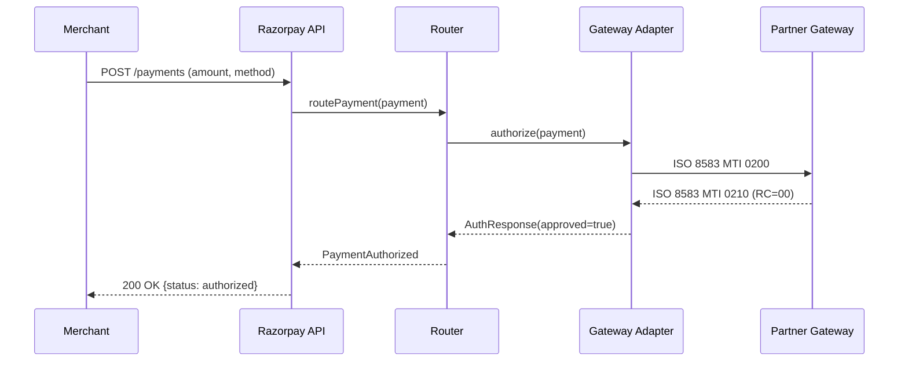

# PRD Generator Skill

Auto-generates production-grade Product Requirements Documents from approved BRDs. Comprehensively covers every integration touchpoint: onboarding, payment processing, settlement, reconciliation, and merchant-facing APIs.

## Purpose

Transform validated BRDs into detailed, actionable PRDs that engineering can implement without ambiguity. The PRD becomes the single source of truth for the integration.

## Input

```json
{
  "brd_id": "uuid",
  "brd_content": {...},
  "integration_context": {
    "partner_name": "HDFC Bank",
    "integration_type": "gateway",
    "payment_methods": ["card", "netbanking", "upi"],
    "geographies": ["India"],
    "expected_gmv": "500CR"
  }
}
```

## Output

A complete PRD with 8 main sections:

### 1. Integration Overview
- Partner profile
- Integration type & scope
- Supported payment methods
- Target geographies
- Expected GMV & volume projections
- Success criteria

### 2. Merchant Onboarding Journey
- KYC requirements by geography
- MID/TID allocation logic
- Terminal provisioning (for POS)
- Credential management (API keys, encryption keys)
- Activation workflow & timelines
- Self-serve vs assisted onboarding

### 3. Pre-Payment Flow
- Order creation & validation
- Payment intent generation
- Routing logic (when to select this gateway)
- Risk checks & fraud screening
- Tokenization (card vault integration)
- 3DS authentication flow (if applicable)

### 4. Payment Processing
- Authorization flow
- Capture flow
- Void/Cancel flow
- ISO 8583 message specifications (if applicable)
- REST API request/response specs (OpenAPI 3.0)
- Timeout handling (100s/145s models)
- Retry logic & idempotency
- Webhook/callback handling

### 5. Post-Payment Flow
- Settlement logic & timelines
- Refund processing (full, partial)
- Chargeback handling
- Reconciliation file formats
- Status polling vs webhooks
- Transaction state machine

### 6. Error Handling
- Complete error code mapping (gateway → Razorpay)
- Fallback logic for failures
- Partial failure scenarios
- Dead letter queue specs
- Customer-facing error messages
- Retry/recovery strategies

### 7. API Specifications
- REST endpoints (OpenAPI 3.0 spec)
- Request/response schemas
- Authentication (OAuth 2.0 / API Key / mTLS)
- Rate limits & throttling
- Pagination for list endpoints
- API versioning strategy

### 8. Non-Functional Requirements
- Latency SLAs (P50, P95, P99)
- Throughput targets (TPS)
- Availability requirements (99.9%, 99.95%, 99.99%)
- Monitoring & alerting specs
- Logging standards (PCI-compliant)
- Security requirements (PCI-DSS, data masking)

## Intelligence Layer

### Cross-Referencing Similar Integrations

```python
def find_reference_integrations(integration_context):
    """Find 3-5 most similar approved integrations"""
    similar = []

    # Match by payment method
    if "upi" in integration_context.payment_methods:
        similar.extend(["Amazon Pay DQR", "PhonePe Switch"])

    # Match by integration type
    if integration_context.integration_type == "gateway":
        similar.extend(["Codec", "JustPay", "HDFC"])

    # Match by geography
    if "UAE" in integration_context.geographies:
        similar.extend(["Mashreq Aani", "Network Aani"])

    return deduplicate_and_rank(similar)
```

### Auto-Generating Diagrams

The PRD includes visual artifacts:

#### Swim Lane Diagram (Pre-Payment Flow)
```
Merchant → API Gateway → Routing Engine → Gateway Adapter → Partner Gateway
   |           |              |                |                  |
   1. Create   2. Validate    3. Select        4. Transform       5. Authorize
   Order       Request        Gateway          Request            Transaction
```

#### Sequence Diagram (Authorization Flow)


#### State Machine (Transaction Lifecycle)
```
CREATED → AUTHORIZED → CAPTURED → SETTLED
   |           |            |          |
   ↓           ↓            ↓          ↓
FAILED     VOIDED      REFUNDED   RECONCILED
```

### Filling Implicit Requirements

When BRD doesn't specify certain details, PRD fills them using platform standards:

| Implicit Requirement | Source |
|---------------------|--------|
| Default timeouts | Platform standard: 30s read, 60s connect |
| Retry logic | 3 retries, exponential backoff (1s, 2s, 4s) |
| Idempotency | UUID-based idempotency keys, 24h dedup window |
| Logging format | JSON structured logs, PCI-compliant field masking |
| Rate limiting | Per-partner: 1000 TPS, Per-merchant: 100 TPS |
| Health check | `/health` endpoint, 200 OK within 1s |

### Regulatory Flagging

```python
def flag_regulatory_requirements(geography, payment_methods):
    flags = []

    if geography == "India":
        if "upi" in payment_methods:
            flags.append({
                "regulation": "NPCI Circular",
                "requirement": "UPI transactions must complete within 2 minutes",
                "reference": "NPCI/2023/UPI/001"
            })
        if "card" in payment_methods:
            flags.append({
                "regulation": "RBI",
                "requirement": "Card data must not be stored post-transaction",
                "reference": "RBI/2018/PCI-DSS"
            })

    if geography == "UAE":
        flags.append({
            "regulation": "CBUAE",
            "requirement": "All payment data must be stored in UAE data centers",
            "reference": "CBUAE/2024/DataResidency"
        })

    return flags
```

## PRD Template Structure

```markdown
# [Partner Name] Integration PRD

**Version:** 1.0
**Author:** GatewayForge AI (Reviewed by [PM Name])
**Date:** [Generated Date]
**Integration Type:** [Gateway/Aggregator/Direct]
**Payment Methods:** [Card/UPI/NetBanking/etc.]
**Target Launch:** [Date from BRD]

---

## 1. Integration Overview

### 1.1 Partner Profile
- **Name:** [Partner]
- **Type:** [Acquiring Bank / Payment Gateway / Aggregator]
- **Geography:** [India / UAE / SEA]
- **Expected GMV:** ₹[X] Cr annually
- **Expected Volume:** [Y] txns/month

### 1.2 Success Criteria
- [X]% authorization success rate
- P95 latency < [Y]ms
- Settlement cycle: T+[N] days
- Zero PCI-DSS compliance violations

---

## 2. Merchant Onboarding Journey

### 2.1 Onboarding Flow
[Detailed flow with decision points]

### 2.2 KYC Requirements
[By merchant category and geography]

### 2.3 MID/TID Allocation
[Logic and validation rules]

---

[Sections 3-8 continue...]

---

## Appendix A: API Specifications (OpenAPI 3.0)
[Complete OpenAPI spec]

## Appendix B: Error Code Mapping
[Gateway code → Razorpay code → Customer message]

## Appendix C: Test Scenarios
[20-30 key test scenarios for QA]

## Appendix D: Deployment Checklist
[Services to deploy, configs to update, feature flags]
```

## Cross-Validation Rules

Before finalizing PRD, validate:

1. **Conflict Detection**: Routing rules don't conflict with existing gateways
2. **Capacity Planning**: Throughput targets align with infra capacity
3. **Feature Completeness**: All payment methods in BRD are covered
4. **Compliance Gaps**: All regulatory requirements from BRD are addressed
5. **Backward Compatibility**: APIs don't break existing merchant integrations

## Output Format

The PRD is generated in two formats:

1. **Markdown** (for PM review/editing)
2. **Structured JSON** (for downstream agents)

```json
{
  "prd_version": "1.0",
  "sections": {
    "integration_overview": {...},
    "onboarding": {...},
    "pre_payment": {...},
    "payment_processing": {...},
    "post_payment": {...},
    "error_handling": {...},
    "api_specs": {...},
    "nfrs": {...}
  },
  "diagrams": {
    "swim_lane": "base64_encoded_svg",
    "sequence": "base64_encoded_svg",
    "state_machine": "base64_encoded_svg"
  },
  "test_scenarios": [...],
  "deployment_checklist": [...]
}
```

## Integration with Pipeline

1. BRD Harmonizer produces GREEN status
2. Temporal workflow triggers PRD Generator
3. PRD Generator fetches reference integrations
4. Generates complete PRD in 10-20 minutes
5. Stores markdown in `prd_documents.content`
6. Stores JSON in `prd_documents.diagrams`
7. Notifies PM for review via email + Slack
8. PM reviews in frontend, makes edits
9. PM approves → Triggers Coding Agent

## Quality Metrics

- **Completeness**: All 8 sections fully populated
- **Consistency**: No contradictions between sections
- **Specificity**: < 5 instances of "TBD" or vague language
- **Traceability**: Every requirement traced back to BRD
- **Testability**: Every feature has corresponding test scenario
